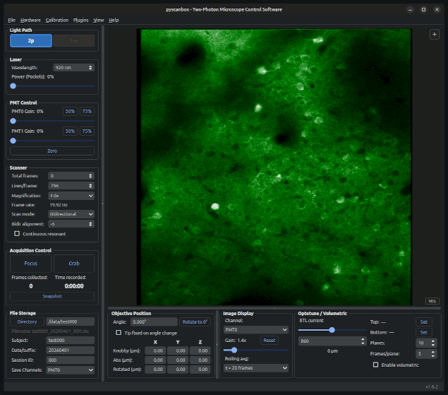

# The Main Interface & Menus

This section explains the main graphical user interface elements within `pyscanbox` to help acquaint you with the layout. Details for specific tools can be found in subsequent sections.

## Overall Layout

The primary `pyscanbox` software window is split into three major panels:

- **Left Controls Panel**: Contains most **Hardware Controls** governing elements such as laser power, scanning parameters, file outputs, and starting acquisition runs.
- **Right Display Panel**: Contains the live Image Canvas which displays the acquired data.
- **Bottom Tools Panel**: Contains secondary tools like the objective position, visualization controls, and volumetric imaging settings.

The sizes of the major sections can be adjusted by clicking and dragging the splitter bars.

## Menu Bar

### File
- **Open Data**: Allows openning previously collected `.sbx` / `.mat` file pairs for data playback. When data is loaded successfully, the *Frame Selector Widget* will appear (it can also be toggled explicitly from the **View** menu). It acts as a timeline transport bar. Changing *Image Display* settings (like rolling avgerage) will work on the loaded data.

- **Exit**: Exits the software.

### Hardware
- Options to connect/disconnect specific hardware devices. Used mostly for testing.

### Calibration
- Options from this menu will open the calibration window for the selected device. See [Hardware Calibration](calibration.md) for more information.

### Plugins
- List of available plugins. You can enable or disable plugins from this menu (or from the config.yaml file).

### View
- **Full screen**: Toggles full screen mode.
- **Show Histogram**: Show/hide the pixel-intensity histogram widget for the current image.
- **Show Frame Selector**: Show/hide the *Frame Selector Widget* for navigating loaded data.
- **Show Command Log**: If enabled, a *Command Log* dock appears at the bottom of the interface. This log shows low-level firmware device traffic. This panel can be floated outside of the main window.

### Help
- **About**: Show information about the software, including version number.

---

Back to [Table of Contents](index.md).

